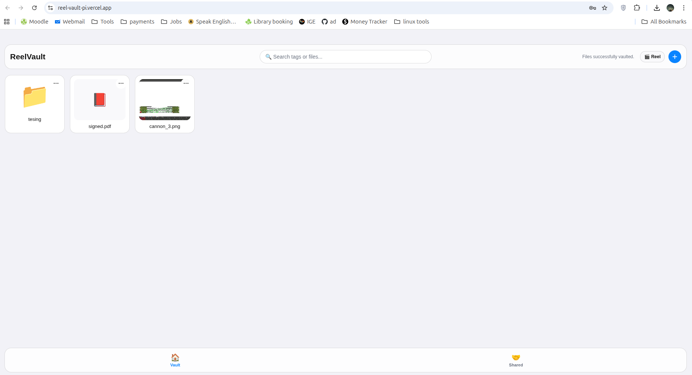
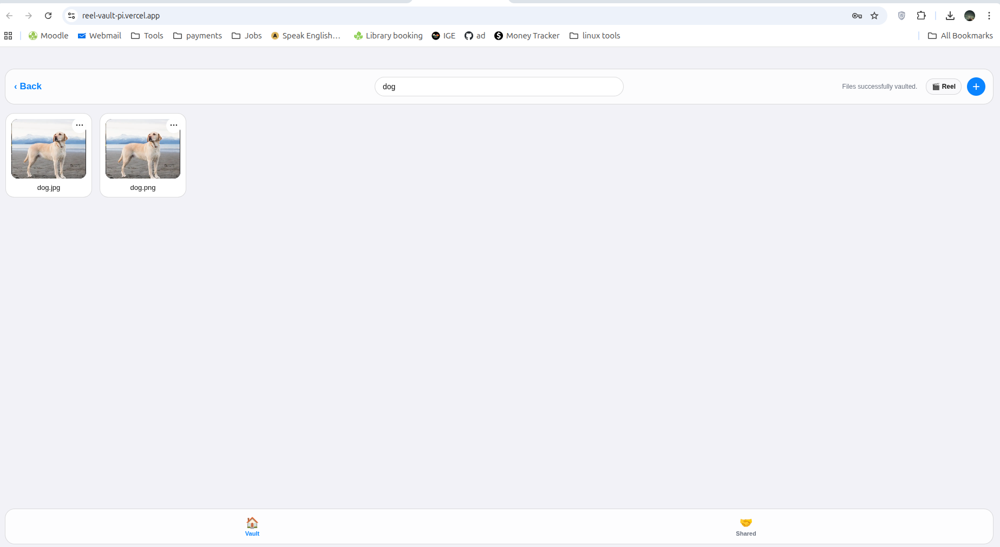
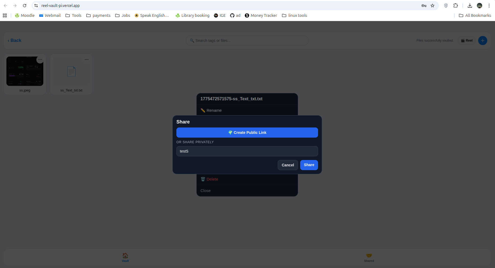
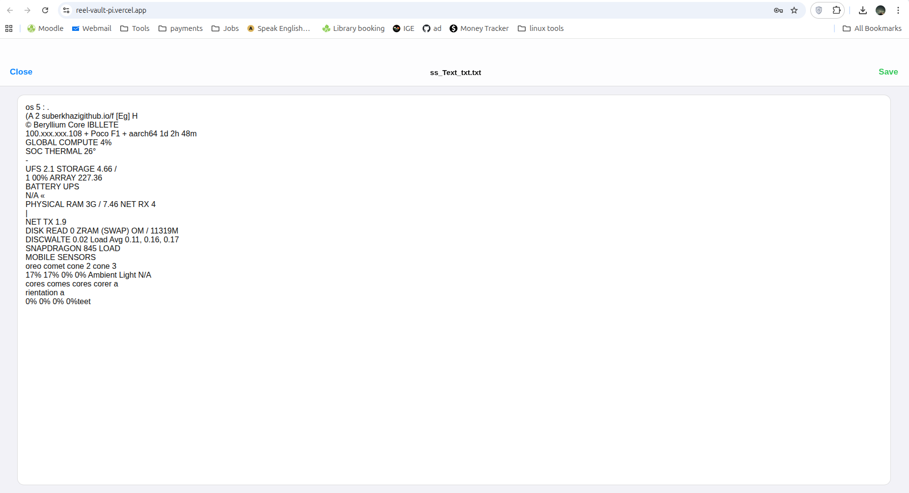

# 🎞️ ReelVault — Private AI Media Cloud on Repurposed Hardware

ReelVault is a full-stack private media vault where the backend and AI run on a **Linux-flashed Headless Xiaomi Poco F1 broken Screen phone** instead of traditional cloud VMs.

I built this to prove that old hardware can still power a real product: web app, Android app (APK), AI tagging, OCR, and sharing — all in one system.

🌐 **Live Web App:** https://reel-vault-pi.vercel.app/  
📱 **Android:** https://github.com/suberkhazi/ReelVault/releases/download/v1/ReelVault.apk

---

## Why this project stands out

Most projects consume managed cloud services.  
ReelVault is engineered end-to-end on constrained hardware:

- 🐧 **postmarketOS Linux Headless Server** on a phone
- 🚇 **Tailscale Funnel** for secure public HTTPS access
- ⚙️ **Node + Express + SQLite** backend
- 🧠 **TensorFlow.js + Tesseract.js** AI pipeline
- 🌐 **Vercel web client + native Android APK**

This is both a product build and a systems engineering exercise.

---

## ⚡ Key Engineering Decisions

### Multi-core AI on top of JavaScript’s single-thread model
AI tasks (image understanding + OCR) are CPU-heavy, so I split them into a **separate worker module/pool**.

That gave me:
- better responsiveness on API routes
- parallel processing across multiple cores
- cleaner separation between request handling and inference

### Self-hosted edge infrastructure
Instead of a cloud VM, the backend/storage runs directly on the Headless Linux phone.  
Public access is handled securely through Tailscale Funnel, allowing clients to connect from anywhere.

---

## ✨ Core Product Features

- 📁 **Private Vault Management**  
  Organize files/folders with nested navigation and vault-style structure.

- 🎞️ **Reel Mode for Personal Memories**  
  A media-first, reel-style experience for viewing private life/trip content or media files.

- 🔍 **Smart Search + OCR**  
  Search across metadata and extracted text from images/documents.
  Extract text from photos and save them as text files.

- 🔗 **Two Sharing Models**
  - **Public sharing**
  - **Share with specific username** (private in-app sharing)

- 🔄 **Rich File Actions**  
  Move, copy, rename, delete, and bulk operations.

- 🧰 **Media Tools**
  - Images → PDF
  - PDF → images
  - OCR endpoint support

---

## 🧩 Architecture Snapshot

**Clients (Web + APK)** → **HTTPS Tunnel (Tailscale Funnel)** → **Express API on Linux Phone** → **SQLite + AI Worker Modules**

This flow keeps media private while still delivering modern cross-platform UX.

---

## 🛠️ Tech Stack

| Layer | Tech |
|---|---|
| Frontend | React / TypeScript |
| Mobile | React Native (Expo) |
| Hosting | Vercel (web) |
| Backend | Node.js / Express |
| Database | SQLite |
| AI/OCR | TensorFlow.js / Tesseract.js |
| Infra | postmarketOS, PM2, Tailscale |

---

## 📸 Screenshots

### Web

### Mobile (APK)

### AI + Sharing

---

## 👨‍💻 Built by

**suberkhazi**  
I like building systems where product, infrastructure, and performance engineering meet.